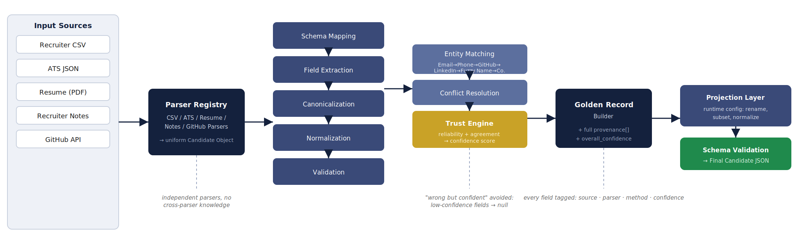

<div align="center">

# 🧩 Multi-Source Candidate Data Transformer

### A Deterministic, Trust-Based Candidate Profile Consolidation Engine

*Entity resolution and data fusion for hiring platforms — built to never guess.*

[](https://www.python.org/)
[](https://docs.pydantic.dev/)
[](https://github.com/maxbachmann/RapidFuzz)
[](https://pytest.org/)
[]()
[]()

📄 **[Read the full Design Document (PDF)](./docs/Candidate_Data_Transformer_Design_Document (1).pdf)**

</div>

---

## 🎯 Why This Project Exists

Recruitment platforms like **Eightfold** pull candidate data from many independent, disagreeing sources — recruiter CSVs, ATS exports, resumes, GitHub, recruiter notes. Downstream AI hiring systems need **one trustworthy profile per candidate**, not five conflicting ones. Getting this wrong doesn't just produce messy data — it can silently bias real hiring decisions.

This is not a resume parser. It's an **entity resolution and data fusion engine** that decides, deterministically and explainably, *which piece of information to trust* when sources disagree — and it would rather tell you it doesn't know than tell you something wrong.

> **Core design principle:** *"Wrong but confident is worse than honestly empty."*
> Every field that can't be trusted above a defined threshold is returned as `null` — never guessed, never hallucinated.

---

## ✨ What It Does

| Capability | Description |
|---|---|
| 🔌 **Multi-source ingestion** | Parses 5 heterogeneous source types — CSV, JSON, PDF resumes, free-text notes, and a live GitHub API — through an extensible parser registry |
| 🧱 **Schema unification** | Maps every source's field names into one canonical candidate schema |
| 🧹 **Canonicalization** | Collapses synonyms (`Google LLC` / `Google Inc.` → `Google`, `CPP` / `C++` → `C++`) |
| 📏 **Normalization** | Phones → E.164, dates → `YYYY-MM`, countries → ISO codes, emails → lowercase |
| 🧑‍🤝‍🧑 **Entity matching** | Cascading identity resolution: Email → Phone → GitHub → LinkedIn → Fuzzy Name → Company |
| ⚖️ **Trust-weighted conflict resolution** | Computes per-field confidence from source reliability, cross-source agreement, and conflict severity |
| 🔍 **Full provenance** | Every field in the output is traceable to its source, parser, normalization method, and confidence score |
| 🛠️ **Configurable projection** | Rename, subset, and reshape the output schema at runtime — no engine code changes required |
| 🛡️ **Fail-safe validation** | Malformed input never crashes the pipeline — it degrades gracefully to `null` |

---

## 🏗️ Architecture

<p align="center">
  
</p>

```
Input Sources
   │  Recruiter CSV · ATS JSON · Resume (PDF) · Recruiter Notes · GitHub API
   ▼
Parser Registry  ──▶  Schema Mapping  ──▶  Field Extraction
   ▼
Canonicalization  ──▶  Normalization  ──▶  Validation
   ▼
Entity Matching  ──▶  Conflict Resolution  ──▶  Trust Engine
   ▼
Golden Record Builder  (+ provenance + overall_confidence)
   ▼
Projection Layer  ──▶  Schema Validation
   ▼
Final Candidate JSON
```

📐 The full architecture, trust-engine math, merge policy, and research basis are documented in detail in the **[Design Document](./docs/Candidate_Data_Transformer_Design_Document.pdf)**.

---

## 🧠 The Trust Engine

The heart of the system. For every candidate attribute, confidence is computed from:

- **Source reliability** — a configurable prior per source (e.g. ATS = `0.95`, Resume = `0.70`, Notes = `0.50`)
- **Cross-source agreement** — values confirmed by multiple independent sources are reinforced
- **Conflict severity** — disagreeing sources reduce confidence proportionally

If confidence falls below threshold, the field is returned as `null` rather than risking a wrong value reaching a hiring decision.

The design is **inspired by** (not a reproduction of) established truth-discovery literature:

- Michelfeit, Knap & Nečaský (2014) — *Linked Data Integration with Conflicts* (ODCS-FusionTool)
- Li et al. (2016) — *A Survey on Truth Discovery*
- Li et al. (2014) — *Resolving Conflicts in Heterogeneous Data by Truth Discovery and Source Reliability Estimation (CRH)*

---

## 📦 Input Sources & Reliability Priors

| Source | Type | Carries | Default Reliability |
|---|---|---|---|
| Recruiter CSV | Structured | Name, Email, Phone, Company, Title | `0.90` |
| ATS JSON | Structured | Experience, education, certifications (nested) | `0.95` |
| Resume (PDF) | Unstructured | Experience, projects, skills, education | `0.70` |
| Recruiter Notes | Unstructured | Observations, interview notes | `0.50` |
| GitHub API | Semi-structured | Name, bio, repositories, languages | `0.85` |

---

## 🧬 Canonical Candidate Schema

```text
candidate_id
full_name
emails[]
phones[]
links
headline
years_experience
skills[]
experience[]
education[]
provenance[]
overall_confidence
```

Every field above ships with a parallel **provenance record**: `{ field, source, parser, normalization_method, match_reasons, confidence }`.

---

## 🛠️ Tech Stack

| Layer | Tools |
|---|---|
| **Language** | Python 3.12 |
| **Parsing** | `pdfplumber`, `pandas`, `json`, `csv` |
| **Normalization** | `phonenumbers`, `dateparser`, `pycountry` |
| **Entity Matching** | `RapidFuzz` |
| **Validation** | `Pydantic` |
| **External API** | `requests` + GitHub REST API |
| **CLI** | `argparse` |
| **Testing** | `pytest` |
| **Tooling** | Git / GitHub |

---

## 🚀 Quick Start

```bash
# 1. Clone the repository
git clone https://github.com/<your-username>/candidate-data-transformer.git
cd candidate-data-transformer

# 2. Install dependencies
pip install -r requirements.txt

# 3. Run the pipeline against sample sources
python -m transformer.cli \
  --csv samples/recruiter.csv \
  --ats samples/ats.json \
  --resume samples/resume.pdf \
  --notes samples/notes.txt \
  --github-username octocat \
  --out candidate_profile.json

# 4. Run with a custom output projection
python -m transformer.cli --config configs/projection.yaml --out custom_profile.json

# 5. Run the test suite
pytest -v
```

### Example output (truncated)

```json
{
  "candidate_id": "cand_8f21a0",
  "full_name": { "value": "Jane Doe", "confidence": 0.96 },
  "emails": ["jane.doe@gmail.com"],
  "phones": ["+916374071150"],
  "headline": { "value": "Senior Backend Engineer", "confidence": 0.81 },
  "skills": ["Python", "C++", "Distributed Systems"],
  "overall_confidence": 0.89,
  "provenance": [
    {
      "field": "phones",
      "source": "resume",
      "normalization": "E.164",
      "matched_with": "ats_json",
      "confidence": 0.89
    }
  ]
}
```

---

## 🗂️ Project Structure

```
candidate-data-transformer/
├── transformer/
│   ├── parsers/          # ResumeParser, CSVParser, ATSParser, GithubParser, NotesParser
│   ├── mapping/          # Schema mapping per source
│   ├── normalize/        # Phone, date, country, email normalizers
│   ├── canonical/        # Canonical dictionaries (companies, skills)
│   ├── matching/         # Entity resolution cascade
│   ├── trust/            # Trust engine & conflict resolution
│   ├── projection/       # Runtime-configurable output projection
│   └── cli.py
├── configs/               # Reliability weights, projection configs
├── samples/                # Sample input sources
├── docs/
│   ├── Candidate_Data_Transformer_Design_Document.pdf
│   └── architecture_diagram.png
├── tests/
└── requirements.txt
```

---

## ✅ Engineering Principles

- **Deterministic, not probabilistic** — same inputs always produce the same output and confidence scores
- **Never invents data** — unknown values stay `null`, by design
- **Fail-safe parsing** — malformed input degrades gracefully, never crashes the pipeline
- **Separation of concerns** — canonical internal record is fully decoupled from configurable output schema
- **Explainable by default** — every field is traceable to its source, method, and confidence
- **Extensible** — new sources plug into the Parser Registry without touching existing parsers

---

## ⚠️ Known Limitations

- No LinkedIn scraping (ToS-compliant by design)
- Resume extraction is rule-based, not LLM-based
- Canonical dictionaries (companies, skill synonyms) require periodic maintenance
- Source reliability weights are configured manually, not learned

## 🔭 Roadmap

- [ ] Adaptive learning of source reliability from historical corrections
- [ ] Incremental profile updates instead of full rebuilds
- [ ] Semantic skill normalization via embeddings
- [ ] Distributed processing for large-scale candidate datasets
- [ ] Interactive dashboard for provenance exploration

---

## 📄 Documentation

| Resource | Description |
|---|---|
| 📘 [Design Document (PDF)](./docs/Candidate_Data_Transformer_Design_Document.pdf) | One-page abstract, full architecture, trust engine, merge policy, references |
| 🖼️ [Architecture Diagram](./docs/architecture_diagram.png) | Visual pipeline reference |

---

<div align="center">

**Built as a deterministic, explainable alternative to black-box candidate matching.**

If you're evaluating this for a role — happy to walk through the trust engine design and tradeoffs live.

</div>
